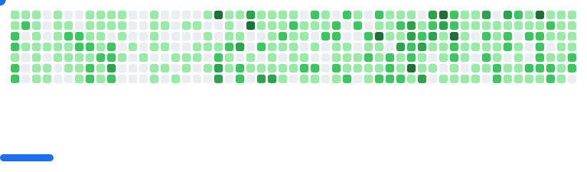

### 👋 Hi, I'm **Jiordi Viera**

I'm a **Full-Stack Developer** specializing in **Laravel**, **Next.js**, and **React**.  
I focus on building **scalable applications, developer tools, and SaaS platforms** that simplify workflows and deliver impact.  
Currently, I’m shaping projects around **developer productivity** and **modern web practices**.

---

### 🚀 Featured Projects

- **🔖 Codepit**  
  A modern snippet manager to organize, share, and discover code snippets.  
  [🔗 Visit Codepit](https://codepit.jiordiviera.me)

- **📨 PulseSend** *(in progress)*  
  SaaS email delivery platform designed for startups that need simple, reliable infrastructure.  

- **🧹 Laravel Log Cleaner**  
  Open-source package for log management and cleanup in Laravel projects.  
  [🔗 View on GitHub](https://github.com/jiordiviera/laravel-log-cleaner)

---

### 🎮 Interactive Contribution Game

<picture>
  <source
    media="(prefers-color-scheme: dark)"
    srcset="images/breakout-dark.svg"
  />
  <source
    media="(prefers-color-scheme: light)"
    srcset="images/breakout-light.svg"
  />
  
</picture>

*Play Breakout with my GitHub contributions — each block represents my coding activity!*

---

### 📊 Development Metrics

- **Active Coding Engagement**  
    
  

- **GitHub Contributions**  
  

- **Tech Stack Overview**  
  

---

### ✍️ Writing & Knowledge Sharing

I write about **Laravel, Next.js, developer tools, and productivity** —  
covering practical guides, architectural decisions, and lessons learned from real-world projects.  

📚 [Read my latest articles](#) <!-- mets ici ton nouveau lien de blog -->

---

### 🛠️ Technical Expertise

- **Backend**: Laravel, PHP, Node.js, Spring Boot  
- **Frontend**: React, Next.js, Tailwind CSS, Livewire  
- **Databases**: MySQL, PostgreSQL, Redis  
- **Other**: Docker, CI/CD (GitHub Actions, GitLab CI), REST APIs, Agile Dev  

---

### 📫 Let’s Connect

- ✉️ Email: **jiordikengne@gmail.com**  
- 💼 LinkedIn: [Jiordi Viera](https://www.linkedin.com/in/jiordiviera)  
- 🔧 GitLab: [@jiordikengne](https://gitlab.com/jiordikengne)  
- 🐙 GitHub: [@jiordiviera](https://github.com/jiordiviera)  

---

⭐️ *“Building tools and platforms that empower developers and businesses across Africa and beyond.”*
